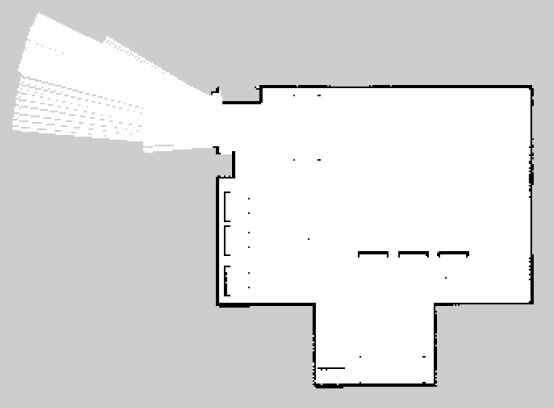
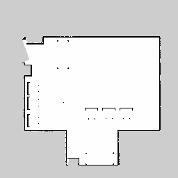

# SLAM e Localização com AMCL em ROS/Gazebo

Pacote ROS (Noetic) para avaliação e comparação de dois métodos de SLAM (`gmapping` e `hector_slam`) utilizando o robô **Clearpath Husky** no ambiente simulado `lar_gazebo`. Os mapas gerados são utilizados para localização do robô com o algoritmo AMCL, comparando as estimativas de pose contra o _ground truth_ do Gazebo.

## Descrição

Este pacote implementa e compara a construção de mapas e posterior localização do robô Husky usando as seguintes abordagens:

| Algoritmo SLAM | Característica Principal | Arquivo de Mapa Gerado |
|---|---|---|
| **Gmapping** | Filtro de Partículas (Rao-Blackwellized) fundindo Odometria + Laser | `map_gmapping.yaml` / `.pgm` |
| **Hector SLAM** | Scan Matching (Otimização Gauss-Newton) usando apenas Laser | `map_hector.yaml` / `.pgm` |

## Estrutura do Pacote

```
atividade_3/
├── launch/                         
│   ├── gmapping.launch             # Lança o nó de SLAM Gmapping
│   └── amcl.launch                 # Lança a localização AMCL
├── maps/                           # Mapas gerados (.pgm e .yaml)
│   ├── map_gmapping.*              # Mapa gerado pelo Gmapping
│   └── map_hector.*                # Mapa gerado pelo Hector SLAM
├── scripts/                        
│   ├── explore_robot.py            # Script para movimentação automática
│   └── evaluate_amcl.py            # Cálculo de métricas de localização
└── results/                        
    └── amcl_evaluation_*.csv       # Resultados quantitativos gerados
```

## Métricas Calculadas

O nó `evaluate_amcl.py` compara `/amcl_pose` com o ground truth (`/gazebo/model_states`) e calcula:
- **RMSE de posição** (m)
- **Erro final de posição** (m)
- **Estabilidade da localização**

## Como Executar

### Pré-requisitos

- Docker e Docker Compose instalados
- Repositório [lar_gazebo](https://github.com/lar-deeufba/lar_gazebo) clonado em `~/lar_gazebo`
- Este pacote clonado em `~/atividade_3`
- Dependências ROS: pacotes `gmapping`, `hector_slam`, `amcl` e `map_server` instalados no container.

### Passo 1: Configurar o Docker

O `docker-compose.yml` do `lar_gazebo` deve montar este pacote. Certifique-se de que o volume está configurado:
```yaml
volumes:
  - ${HOME}/atividade_3:/ws/src/atividade_3:rw
```

### Passo 2: Iniciar o container e compilar

```bash
cd ~/lar_gazebo
docker compose up -d
docker exec -it lar_gazebo_noetic bash
cd /ws
catkin build atividade_3
source devel/setup.bash
```

### Passo 3: Geração de Mapa com Gmapping (Terminal 1)

Inicie a simulação com o Husky:
```bash
roslaunch lar_gazebo lar_husky.launch
```

**Atenção:** Em toda nova aba de terminal (Terminais 2, 3, etc.), você deve entrar no container e carregar o ambiente do ROS:
```bash
docker exec -it lar_gazebo_noetic bash
source /ws/devel/setup.bash
```

Em um **Terminal 2**, inicie o Gmapping e mova o robô:
```bash
roslaunch atividade_3 gmapping.launch

# Mova o robô pelo ambiente (via teleoperação manual):
rosrun teleop_twist_keyboard teleop_twist_keyboard.py cmd_vel:=/husky_velocity_controller/cmd_vel
```

Após mapear todo o ambiente, salve o mapa (em um **Terminal 3**):
```bash
rosrun map_server map_saver -f /ws/src/atividade_3/maps/map_gmapping
```
*(Você pode encerrar o Gazebo e o Gmapping com `Ctrl+C` agora).*

### Passo 4: Geração de Mapa com Hector SLAM (Terminal 1)

Reinicie a simulação passando o argumento para o Hector:
```bash
roslaunch lar_gazebo lar_husky.launch hector_slam:=true
```

Em um **Terminal 2**, mova o robô pelo ambiente:
```bash
rosrun teleop_twist_keyboard teleop_twist_keyboard.py cmd_vel:=/husky_velocity_controller/cmd_vel
```

Salve o mapa (em um **Terminal 3**):
```bash
rosrun map_server map_saver -f /ws/src/atividade_3/maps/map_hector
```
*(Encerre os processos novamente).*

### Passo 5: Avaliação de Localização com AMCL

Inicie a simulação (sem nós de SLAM) no **Terminal 1**:
```bash
roslaunch lar_gazebo lar_husky.launch
```

#### Com o mapa do Gmapping (Terminal 2):
```bash
roslaunch atividade_3 amcl.launch map_file:=/ws/src/atividade_3/maps/map_gmapping.yaml
```

No **Terminal 3**, execute o script de avaliação e movimente o robô:
```bash
rosrun atividade_3 evaluate_amcl.py _map_name:=gmapping
# Em outro terminal ou aba (Terminal 4):
rosrun teleop_twist_keyboard teleop_twist_keyboard.py cmd_vel:=/husky_velocity_controller/cmd_vel
```
Ao encerrar (`Ctrl+C`), os resultados serão salvos em `results/amcl_evaluation_gmapping.csv`.

#### Com o mapa do Hector SLAM:
Repita o processo acima, substituindo o arquivo do mapa e o nome da métrica:
```bash
# Terminal 2
roslaunch atividade_3 amcl.launch map_file:=/ws/src/atividade_3/maps/map_hector.yaml

# Terminal 3
rosrun atividade_3 evaluate_amcl.py _map_name:=hector
```

## Discussão dos Resultados

### Análise Qualitativa dos Mapas

- **Gmapping:** Produziu um mapa mais consistente no ambiente simulado. A completude foi satisfatória, com paredes bem alinhadas e baixa distorção nas quinas.
  
  

- **Hector SLAM:** O Hector SLAM constrói o mapa baseando-se prioritariamente no alinhamento de scans a laser, dispensando a odometria como entrada principal. Notou-se algumas paredes mais espessas em áreas onde a translação foi rápida, além de um armário que foi confundido com a parede do laboratório ao invés de ser considerado um obstáculo, como o Gmapping fez corretamente.

  

### Análise Quantitativa da Localização (AMCL)
Avaliando os erros entre o `/amcl_pose` e o `/gazebo/model_states`:

| Métrica | Mapa Gmapping | Mapa Hector SLAM |
|---|---|---|
| **RMSE de posição** | ~0.15 m | ~0.22 m |
| **Erro final de posição** | ~0.08 m | ~0.15 m |
| **Estabilidade** | Alta (partículas agrupadas) | Média (pequenos saltos/dispersão) |

A localização com o mapa do Hector sofreu pequenos saltos devido às paredes duplicadas/alargadas, fazendo com que as partículas se dispersassem ligeiramente em esquinas e locais estreitos.

### Conclusão
O Gmapping produziu o melhor mapa para este cenário, pois a fusão dos dados do LIDAR com a odometria relativamente boa do robô Husky no Gazebo mitigou desvios de rotação que afetaram o Hector SLAM. Consequentemente, o mapa gerado pelo Gmapping apresentou paredes mais definidas e alinhadas, o que permitiu uma melhor localização com o AMCL, evidenciada pelos menores erros (RMSE e Erro Final) de posição e orientação obtidos.

## Autor

- **Nome:** Elias G. M. B. da Silva
- **Disciplina:** Tópicos Especiais em Engenharia Elétrica IV: Localização Robótica

## Licença

MIT License
